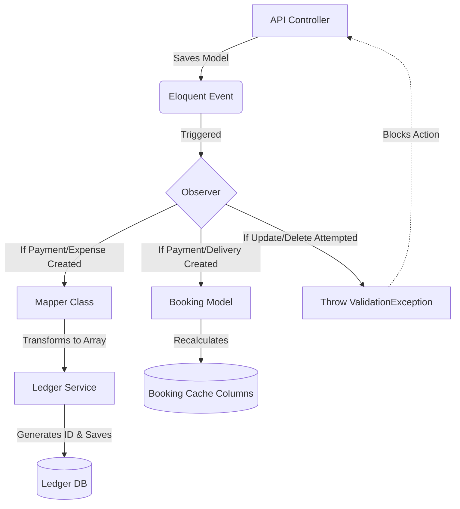

# ASG ERP V2 - Architecture Documentation

This document serves as the master reference for the backend architecture, module relationships, and strict financial data flow within ASG ERP V2. 

---

## 1. Core Principles & Business Rules
- **Ledger as the Single Source of Truth:** All financial aggregation and dashboard metrics are drawn directly from the immutable `ledgers` table.
- **Strict Immutability:** Financial source records (`Payment`, `Expense`) are structurally locked. Once inserted, they cannot be updated or destroyed via the API. Mistakes must be handled via explicit reversing transactions (refunds/adjustments).
- **Service & Observer Segregation:** Controllers handle HTTP transport and validation. Observers handle domain event orchestration. Services encapsulate complex logic (e.g., transaction numbering). Mappers abstract data transformation.
- **Booking is NOT Financial:** A `Booking` represents a customer order. It tracks the items, customer details, and expected totals, but it never interacts with the Ledger directly. It calculates its paid amounts and remaining balances dynamically based on its related `Payments`.
- **Delivery is purely Logistical:** A `Delivery` only confirms that goods have physically been handed over. It contains zero financial logic and creates no Ledger entries.

---

## 2. Database Relationships

The system relies on a highly normalized, relationally constrained MySQL database.

### Foundational / Global Models
- **Shop:** The fundamental operating location. (`Bookings`, `Expenses`, `Ledgers` belong to a Shop).
- **Department / Expense Category / Expense Master:** A strict hierarchical chain (Master belongs to Category, Category belongs to Department).
- **Employee:** Associated with specific Expenses or future Payroll modules.
- **Payment Method:** The financial medium (Cash, Bank, Wallet, etc.).

### Transactional Models
- **Booking:** Has One `Delivery`, Has Many `Payments`.
- **Delivery:** Belongs To `Booking`.
- **Payment:** Belongs To `Booking`.
- **Expense:** Belongs To `Expense Master`, `Expense Category`, `Department`, `Employee`, `Shop`, and `Payment Method`.
- **Ledger:** Polymorphically relates to source models (`Payment`, `Expense`, etc.) via `reference_type` and `reference_id`. Self-references via `reversal_of`.

---

## 3. The Status Flow

The `Booking` status is a dynamic, automated state machine. It is recalculated automatically by the `Booking::recalculateStatus()` method, which is triggered by Eloquent Observers anytime a related Payment or Delivery is mutated.

**Status Integers:**
- `0` = Stock
- `1` = Partially Paid
- `2` = Fully Paid
- `3` = Delivered
- `4` = Cancelled

**Transition Logic:**
1. If the Booking is `Cancelled (4)`, it remains cancelled regardless of payments.
2. If a `Delivery` exists, the status is forcefully pushed to `Delivered (3)`.
3. If no delivery exists:
   - If `total_paid` == 0, status is `Stock (0)`.
   - If `total_paid` > 0 AND `remaining_balance` > 0, status is `Partially Paid (1)`.
   - If `remaining_balance` <= 0, status is `Fully Paid (2)`.

---

## 4. The Observer Flow

To prevent bloated controllers and guarantee that the Ledger and Booking statuses are never bypassed, the application utilizes a strict Observer architecture.

---

## 5. The Payment Flow

1. Client submits POST `/api/payments`.
2. `StorePaymentRequest` dynamically calculates the maximum allowable payment using `$booking->remaining_balance` and validates the input.
3. `PaymentController` wraps the request in a `DB::transaction()` with a `lockForUpdate()` on the parent `Booking` to absolutely prevent concurrent overpayments.
4. `Payment` is saved to the database.
5. `PaymentObserver` hooks the `created` event:
   - Passes the `Payment` to the `PaymentLedgerMapper`.
   - Passes the mapped array to `LedgerService`, which safely writes a `CREDIT` to the `Ledger`.
   - Triggers `$payment->booking->recalculateStatus()`.
6. `Booking` performs an SQL `SUM` of all its payments, updates its cached `total_paid` and `remaining_balance` columns, evaluates the new state integer, and saves itself.
7. Controller returns the successfully created `PaymentResource`.

---

## 6. The Ledger Engine Flow

The Ledger is an immutable, append-only, high-performance event store.

**Immutability:**
- Source models (`Payment`, `Expense`) have their `update` and `destroy` API routes unregistered.
- The `LedgerController` exposes only `index` and `summary` endpoints (Read-Only). No CRUD exists for the ledger.

**Service Abstraction:**
- The `LedgerService` handles the concurrency-safe generation of the human-readable transaction number (e.g., `LED2026000001`).

**Polymorphism:**
- Instead of duplicating specific columns (like `booking_id` or `employee_id`), the Ledger uses `reference_type` and `reference_id` to polymorphically associate with the exact source record.

**Reversals:**
- Correcting mistakes requires an explicit negative transaction (or a designated Refund process). The new transaction uses the `reversal_of` foreign key to point to the original erroneous Ledger row, while the original row has its `is_reversed` flag flipped to true.

**High-Performance Aggregation:**
- The `/api/ledgers/summary` endpoint bypasses standard Eloquent hydration and executes a raw SQL `SUM()` across the millions of rows (leveraging the composite index on `shop_id` and `entry_date`) to return instant dashboard metrics (Credit, Debit, Balance) excluding reversed entries.
