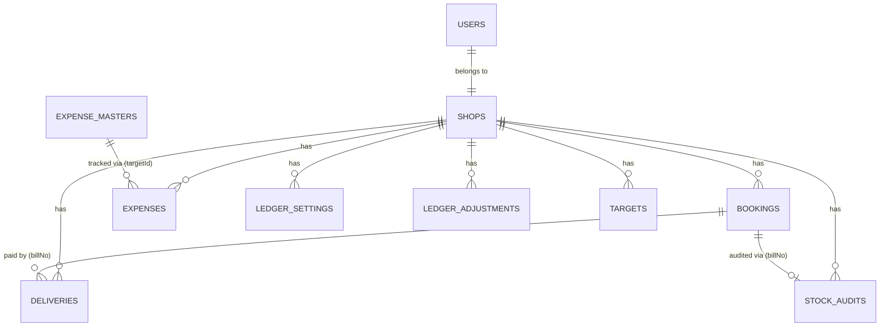

# MongoDB Analysis - Version 2 Migration

This document provides a complete architectural analysis of the existing MongoDB implementation in the `asg-ahmad-v2` codebase, acting as the foundation for the future MySQL migration.

---

## 1. Global Collections

### Collection Name: `users`
**Purpose**: Stores authentication credentials, roles, and shop associations for the global dashboard and individual shop access.
**Current Schema**: `userSchema` (Mongoose)
**Field List**: `_id`, `username`, `password`, `role`, `shop`, `__v`
**Field Types**: `ObjectId`, `String`, `String`, `String (Enum: admin, shop)`, `String`
**Indexes**: `username` (unique: true)
**Relationships**: Links a user to a specific shop via the canonical `shop` name (e.g., 'Gaidatailor').
**Referenced By**: Middleware (`auth.js`) validates JWTs containing the user's `username` and `role`.
**Which API endpoints use this collection?**: 
- `POST /api/auth/login`
- `POST /api/auth/register`
**Which frontend modules use this collection?**: 
- Not directly used by frontend modules, only via Login interface/JWT token management.
**Business Rules**: 
- `admin` role can access all shops via Global Dashboard.
- `shop` role can only access the shop defined in the `shop` field.
**Validation Rules**: `username` and `password` are required.
**Current Queries**: `User.findOne({ username })`
**Aggregation Pipelines**: None.
**Performance Considerations**: Negligible. Small dataset.
**Known Problems**: Passwords are in plain text/hashed? Needs checking (assumed hashed via bcrypt in `authRoutes.js`).
**Migration Difficulty**: Low
**Recommended MySQL Table**: `users`
**Recommended Foreign Keys**: `shop_id` referencing a `shops` lookup table instead of a string.
**Recommended Constraints**: UNIQUE constraint on `username`.
**Migration Notes**: Normalize `shop` into a foreign key.
**Risk Level**: Low
**Example Documents**:
```json
{
  "_id": "6458...",
  "username": "gaidatailor",
  "password": "$2b$...",
  "role": "shop",
  "shop": "Gaidatailor"
}
```

### Collection Name: `expensemasters`
**Purpose**: Master data list for strict, ID-driven expense entry (Employee and General targets).
**Current Schema**: `ExpenseMasterSchema` (Mongoose)
**Field List**: `_id`, `targetId`, `name`, `type`, `department`, `category`, `isActive`, `createdAt`, `updatedAt`
**Field Types**: `ObjectId`, `String`, `String`, `String (Enum: employee, general)`, `String`, `String`, `Boolean`, `Date`, `Date`
**Indexes**: `targetId` (unique: true)
**Relationships**: Referenced via `targetId` in dynamic `[shopPrefix]expenses` collections.
**Referenced By**: Master Data Management API.
**Which API endpoints use this collection?**:
- `GET /api/master/expenses`
- `POST /api/master/expenses`
- `PUT /api/master/expenses/:id`
**Which frontend modules use this collection?**: `master_data.js`, `add_entry.js` (for dropdown population).
**Business Rules**: Used to auto-lock Department and Category fields based on the selected master record to eliminate manual entry errors.
**Validation Rules**: All fields required except `isActive` (defaults to true).
**Current Queries**: `ExpenseMaster.find({ isActive: true }).sort({ name: 1 })`, `findOne({ targetId: targetId.trim() })`
**Aggregation Pipelines**: None.
**Performance Considerations**: Low impact. Standard lookup table.
**Known Problems**: None.
**Migration Difficulty**: Low
**Recommended MySQL Table**: `expense_masters`
**Recommended Foreign Keys**: `department_id`, `category_id` (if normalized further).
**Recommended Constraints**: UNIQUE constraint on `target_id`.
**Migration Notes**: Direct 1:1 mapping. Consider normalizing `department` and `category` to lookup tables.
**Risk Level**: Low

### Collection Name: `ledgersettings`
**Purpose**: Stores initial balance and start date for each shop's daily ledger calculation.
**Current Schema**: `ledgerSettingsSchema`
**Field List**: `_id`, `shop`, `initialBalance`, `startDate`, `__v`
**Field Types**: `ObjectId`, `String`, `Number`, `Date`, `Number`
**Indexes**: `shop` (unique: true)
**Relationships**: Associated with a specific shop.
**Referenced By**: `daily_ledger`, `ledger/history` endpoints.
**Which API endpoints use this collection?**:
- `GET /api/:shop/daily_ledger`
- `GET /api/:shop/ledger/history`
**Which frontend modules use this collection?**: `dailyLedger.js`
**Business Rules**: Ledger balances are calculated historically from the `startDate` using the `initialBalance` as the baseline.
**Validation Rules**: `shop` and `startDate` required.
**Current Queries**: `LedgerSettings.findOne({ shop })`
**Aggregation Pipelines**: None.
**Performance Considerations**: Required on almost every ledger fetch; could be cached.
**Known Problems**: If the start date is far in the past, calculating the running balance dynamically every time is highly inefficient.
**Migration Difficulty**: Low
**Recommended MySQL Table**: `shop_ledger_settings`
**Recommended Foreign Keys**: `shop_id`
**Recommended Constraints**: UNIQUE constraint on `shop_id`.
**Migration Notes**: Direct 1:1 mapping.
**Risk Level**: Low

### Collection Name: `ledgeradjustments`
**Purpose**: Stores daily short/extra cash adjustments.
**Current Schema**: `ledgerAdjustmentSchema`
**Field List**: `_id`, `shop`, `date`, `amount`, `note`, `__v`
**Field Types**: `ObjectId`, `String`, `Date`, `Number`, `String`, `Number`
**Indexes**: Composite `shop` + `date` (unique: true)
**Relationships**: Associated with a shop and a specific day.
**Referenced By**: Ledger calculations.
**Which API endpoints use this collection?**:
- `GET /api/:shop/daily_ledger`
- `GET /api/:shop/ledger/history`
**Which frontend modules use this collection?**: `dailyLedger.js`
**Business Rules**: Ensures only one adjustment entry per shop per day. Positive amount for extra, negative for short.
**Validation Rules**: `shop`, `date`, `amount` required.
**Current Queries**: `findOne`, `find`, `aggregate` (summing amounts).
**Aggregation Pipelines**: `{ $match: { shop, date: ... } }, { $group: { _id: null, total: { $sum: "$amount" } } }`
**Performance Considerations**: Aggregated on the fly.
**Known Problems**: None.
**Migration Difficulty**: Low
**Recommended MySQL Table**: `ledger_adjustments`
**Recommended Foreign Keys**: `shop_id`
**Recommended Constraints**: UNIQUE constraint on `(shop_id, date)`.
**Migration Notes**: Direct mapping.
**Risk Level**: Low

### Collection Name: `targets`
**Purpose**: Stores monthly financial targets for shops.
**Current Schema**: `TargetSchema`
**Field List**: `_id`, `shop`, `year`, `month`, `amount`, `createdAt`, `updatedAt`
**Field Types**: `ObjectId`, `String`, `Number`, `Number`, `Number`, `Date`, `Date`
**Indexes**: None explicit.
**Relationships**: By shop, year, month.
**Referenced By**: Analytics dashboard.
**Which API endpoints use this collection?**: `GET /api/analytics/targets`
**Which frontend modules use this collection?**: Dashboard/Analytics components.
**Business Rules**: None significant.
**Validation Rules**: Standard schema validation.
**Current Queries**: Find by shop, year.
**Aggregation Pipelines**: None.
**Performance Considerations**: Small data size.
**Known Problems**: Month is stored as 0-11, might be confusing.
**Migration Difficulty**: Low
**Recommended MySQL Table**: `shop_targets`
**Recommended Foreign Keys**: `shop_id`
**Recommended Constraints**: UNIQUE constraint on `(shop_id, year, month)`.
**Migration Notes**: Convert 0-indexed month to standard 1-12.
**Risk Level**: Low

---

## 2. Dynamic Collections (Per-Shop)

### Collection Name: `[shopPrefix]bookings`
**Purpose**: Records customer orders/bookings.
**Current Schema**: `BookingSchema` (strict: false)
**Field List**: `_id`, `billNo`, `name`, `date`, `countryCode`, `phone`, `qty`, `amount`, `noOfUpdates`, `status`, `createdAt`, `updatedAt`, (and potentially other unstructured fields)
**Field Types**: `ObjectId`, `String`, `String`, `Date`, `String`, `String`, `Number`, `Number`, `Number`, `String`, `Date`, `Date`
**Indexes**: `billNo` (index: true), `date` (index: true)
**Relationships**: Loosely coupled to Deliveries and Audits via the `billNo` string.
**Referenced By**: Almost all financial and analytical calculations.
**Which API endpoints use this collection?**:
- `POST /api/:shop/bookings/create`
- `PUT /api/:shop/bookings/update/:id`
- `GET /api/:shop/bookings/summary`
- `GET /api/:shop/monthly_summary/summary`
- `GET /api/global/summary`
- `GET /api/:shop/stock_audit`
- `GET /api/:shop/bill_details`
- `GET /api/:shop/daily_ledger`
**Which frontend modules use this collection?**: `add_entry.js`, `edit_entry.js`, `stock_audit.js`, `dailyLedger.js`, `overview.js`, `main.js`
**Business Rules**: 
- `billNo` must be unique per shop, EXCEPT for "other-amounts".
- If `status` is "cancel", "canceled", "cancelled", or "deducted", the amount is excluded from net income.
**Validation Rules**: `date` and `amount` are required.
**Current Queries**: Find by date range, find by `billNo`.
**Aggregation Pipelines**: Heavy usage.
- `$group` by `null` to get `totalAmount`
- `$cond` to calculate `canceledAmount`
- Monthly grouping by `$year` and `$month`
**Performance Considerations**: This is the largest collection. Index on `date` is critical for aggregation performance. `strict: false` allows dirty data.
**Known Problems**: `strict: false` means data schema is not guaranteed. `status` checks rely on varied casing and spelling ("cancel", "canceled", "cancelled"). String-based linking to deliveries using `billNo`.
**Migration Difficulty**: High
**Recommended MySQL Table**: `bookings`
**Recommended Foreign Keys**: `shop_id`
**Recommended Constraints**: UNIQUE constraint on `(shop_id, bill_no)` where `bill_no != 'other-amounts'`.
**Migration Notes**: Requires extensive data cleaning. `status` must be standardized into an ENUM. `countryCode` and `phone` should be standardized. Unstructured data needs a JSON column or to be discarded if unused.
**Risk Level**: High (due to unstructured data and loose string joins).
**Example Documents**:
```json
{
  "_id": "64...",
  "billNo": "10542",
  "name": "Ahmed",
  "date": "2023-10-15T00:00:00.000Z",
  "amount": 500,
  "status": "active"
}
```

### Collection Name: `[shopPrefix]deliveries`
**Purpose**: Records payments received/services delivered against bookings.
**Current Schema**: `DeliverySchema` (strict: false)
**Field List**: `_id`, `billNo`, `amount`, `date`, `amountType`, `noOfUpdates`, `createdAt`, `updatedAt`
**Field Types**: `ObjectId`, `String`, `Number`, `Date`, `String`, `Number`, `Date`, `Date`
**Indexes**: `billNo` (index: true), `date` (index: true)
**Relationships**: Links to Bookings via `billNo`.
**Referenced By**: Ledger, Global Summary, Lifetime Summary.
**Which API endpoints use this collection?**:
- `POST /api/:shop/delivery/create`
- `GET /api/:shop/daily_ledger`
- `GET /api/global/summary`
- `GET /api/:shop/accrual_delivery/summary`
**Which frontend modules use this collection?**: `dailyLedger.js`, `render.js`, `main.js`
**Business Rules**: 
- Determines daily cash box balance based on `amountType`.
- Types matching `/card|visa|master|adib/i` are considered ADIB (Bank).
- Types matching `/atm/i` are considered ATM.
- Anything else (or missing) defaults to CASH.
**Validation Rules**: `amount` and `date` are required.
**Current Queries**: Find by `billNo`, find by date range.
**Aggregation Pipelines**: Extensive usage. Heavy reliance on RegEx inside `$cond` statements to classify payment types dynamically.
**Performance Considerations**: RegEx inside `$group` aggregates is slow. No referential integrity with Bookings.
**Known Problems**: Loose classification of `amountType` via regex is fragile. `billNo` might refer to a booking that doesn't exist.
**Migration Difficulty**: Medium-High
**Recommended MySQL Table**: `deliveries` (or `payments`)
**Recommended Foreign Keys**: `shop_id`, `booking_id` (migrated from `billNo`).
**Recommended Constraints**: Foreign key constraint to bookings.
**Migration Notes**: Need to map the string `billNo` to a hard foreign key `booking_id`. `amountType` must be standardized into an ENUM or a `payment_method_id`.
**Risk Level**: Medium

### Collection Name: `[shopPrefix]expenses`
**Purpose**: Records shop expenditures.
**Current Schema**: `ExpenseSchema` (strict: false)
**Field List**: `_id`, `amount`, `date`, `dept`, `cat`, `name`, `targetId`, `expenseType`, `noOfUpdates`, `createdAt`, `updatedAt`
**Field Types**: `ObjectId`, `Number`, `Date`, `String`, `String`, `String`, `String`, `String (Enum: employee, general)`, `Number`, `Date`, `Date`
**Indexes**: `date` (index: true)
**Relationships**: `targetId` relates back to `ExpenseMaster`.
**Referenced By**: Ledger, Employee summaries, Global summaries.
**Which API endpoints use this collection?**:
- `POST /api/:shop/expense/create`
- `GET /api/:shop/expense/employees`
- `GET /api/:shop/employee/summary`
- `GET /api/global/summary`
**Which frontend modules use this collection?**: `dailyLedger.js`, `main.js`, `master_data.js`
**Business Rules**: 
- If `dept` is "profit", it's excluded from operational expenses and tracked as "profit payout".
**Validation Rules**: `amount` and `date` are required.
**Current Queries**: Group by `name`, sum by `dept`.
**Aggregation Pipelines**: Used to generate employee summaries.
**Performance Considerations**: Aggregations rely heavily on `$toLower` and `$trim` to group by `name` or `dept` dynamically. Very slow on large datasets.
**Known Problems**: Free text entry for `name`, `dept`, and `cat` in legacy data requires `$trim` and `$toLower` to group correctly.
**Migration Difficulty**: Medium
**Recommended MySQL Table**: `expenses`
**Recommended Foreign Keys**: `shop_id`, `expense_master_id` (via `targetId`).
**Recommended Constraints**: FK constraints.
**Migration Notes**: Clean up historical names/depts/cats to match standard Master Data IDs.
**Risk Level**: Medium

### Collection Name: `[shopPrefix]audit`
**Purpose**: Tracks verified and archived physical stock items during stock audits.
**Current Schema**: `AuditSchema` (strict: false)
**Field List**: `_id`, `billNo`, `remark`, `qty`, `missingPcs`, `amount`, `batchLabel`, `checkedAt`, `status`
**Field Types**: `ObjectId`, `String`, `String`, `Number`, `Number`, `Number`, `String`, `Date`, `String (Checked/Archived)`
**Indexes**: `billNo` (index: true)
**Relationships**: Links to Bookings via `billNo`.
**Referenced By**: Stock Audit UI.
**Which API endpoints use this collection?**:
- `GET /api/:shop/stock_audit`
- `POST /api/:shop/stock_audit/verify`
- `POST /api/:shop/stock_audit/archive`
**Which frontend modules use this collection?**: `stock_audit.js`, `audit.js`
**Business Rules**: Stock is pending if there's a balance (`booked amount - delivered amount > 0`) and `status != cancel/deducted` and `billNo` is not in the `audit` collection as 'Checked'.
**Validation Rules**: None strict.
**Current Queries**: `find({ status: 'Checked' })`
**Aggregation Pipelines**: None.
**Performance Considerations**: In-memory JS joining in `createStockAuditRoute`: fetching all audits, all bookings, all deliveries, and joining them via maps/Sets in JS.
**Known Problems**: Application-level JOINs are memory-intensive and scale poorly.
**Migration Difficulty**: Low (Table structure), High (Refactoring queries).
**Recommended MySQL Table**: `stock_audits`
**Recommended Foreign Keys**: `shop_id`, `booking_id`
**Recommended Constraints**: UNIQUE constraint on `(shop_id, booking_id)` if an item can only be checked once per batch.
**Migration Notes**: The manual JS joining must be replaced by a proper SQL `LEFT JOIN` or View.
**Risk Level**: Low

---

## 3. Cross Collection Analysis

### Relationship Diagram


### Collection Dependencies
- **Bookings, Deliveries, and Audits** are deeply intertwined via the `billNo` string. This acts as a soft, unenforced foreign key.
- **Expenses** depend on **ExpenseMasters**.
- **Daily Ledger** aggregates data from **LedgerSettings**, **LedgerAdjustments**, **Deliveries**, and **Expenses**.

### Target Architecture (Relational Models)
**One Table**:
- `users`, `expense_masters`

**Multiple Tables (Consolidated)**:
Currently, the system uses dynamic collections (e.g., `Gaidatailorbookings`, `Naseembookings`). In MySQL, this **MUST** become:
- ONE `bookings` table with a `shop_id` column.
- ONE `deliveries` table with a `shop_id` column.
- ONE `expenses` table with a `shop_id` column.
- ONE `stock_audits` table with a `shop_id` column.

**Lookup Tables (New)**:
- `shops` (id, name, canonical_name)
- `payment_methods` (id, name) -> To replace regex-based `amountType` parsing.
- `expense_departments`
- `expense_categories`

**Missing Constraints Enforced in Code**:
- Uniqueness of `billNo` per shop (checked manually in POST routes).
- Referential integrity: Delivery `billNo` must exist in Bookings.
- Stock Audit `billNo` must exist in Bookings.

---

## 4. Business Logic Analysis

### Where business logic currently lives
The vast majority of business logic resides in **Route Handlers / Route Creators** (`api/_lib/utils/routeCreators.js` and `globalRoutes.js`).

Examples:
- **Ledger Math**: Calculates running balances by fetching previous history iteratively and applying adjustments. (Found in `createDailyLedgerRoute`).
- **Payment Method Classification**: Hardcoded Regex inside MongoDB `$cond` aggregation pipelines. (Found in `globalRoutes.js`).
- **Net vs Gross Income**: Manual subtraction of `$cancelAmount` based on case-insensitive string matching of status fields.
- **Stock Audit Pending Logic**: In-memory JS loops cross-referencing three separate datasets (Bookings, Deliveries, Audits) to find items with >0 balance. (Found in `createStockAuditRoute`).

### Target Architecture Mapping
- **Database (SQL Views/Stored Procs)**:
  - Net vs Gross Booking logic.
  - Pending Stock calculation (can be a simple View utilizing `LEFT JOIN` and `SUM()`).
- **Service Layer (New)**:
  - Ledger Balance calculations.
  - Stock Auditing archive actions.
- **Controller (New)**:
  - Request validation and response formatting.
- **Middleware**:
  - Authentication and Shop scoping.

---

## 5. API Analysis

### Example: Global Summary (`/api/global/summary`)
- **Route**: `GET /api/global/summary`
- **Purpose**: High-level metrics for all shops.
- **Mongo Collections Used**: ALL Bookings, Deliveries, and Expenses across all 9 shops.
- **Queries Executed**: 5 distinct aggregation pipelines * 9 shops = 45 parallel aggregations.
- **Potential MySQL Equivalent**: A single `SELECT` query utilizing `GROUP BY shop_id` and `SUM()` across the consolidated tables. This will be exponentially faster.

### Example: Daily Ledger (`/api/:shop/daily_ledger`)
- **Route**: `GET /api/:shop/daily_ledger`
- **Purpose**: Calculates cash drawer balance.
- **Mongo Collections Used**: `LedgerSettings`, `LedgerAdjustments`, `Deliveries`, `Expenses`, `Bookings`.
- **Queries Executed**: Fetches all historical deliveries and expenses from the `startDate` to calculate the opening balance every single time it's called.
- **Potential MySQL Equivalent**:
  - Requires architecture change. Daily closing balances should be materialized/persisted in a `daily_ledger_balances` table. Calculating history from 2020 on every page load is an anti-pattern.

### Example: Stock Audit (`/api/:shop/stock_audit`)
- **Route**: `GET /api/:shop/stock_audit`
- **Purpose**: Lists items that need to be audited.
- **Mongo Collections Used**: Bookings, Deliveries, Audits.
- **Queries Executed**: `find()` all bookings, `find()` all deliveries, `find()` all audits, then manually join them in JavaScript.
- **Potential MySQL Equivalent**: 
```sql
SELECT b.bill_no, b.amount - COALESCE(SUM(d.amount), 0) AS balance
FROM bookings b
LEFT JOIN deliveries d ON b.id = d.booking_id
LEFT JOIN stock_audits a ON b.id = a.booking_id
WHERE a.id IS NULL AND b.status NOT IN ('cancel', 'deducted')
GROUP BY b.id
HAVING balance > 0;
```

---

## 6. Frontend Dependency Analysis

The frontend in `client/src/modules/` is tightly coupled to the REST API structure but NOT to MongoDB directly.
- **`dailyLedger.js`**: Depends heavily on the structured response of `daily_ledger` API. Requires the breakdown of payment types (`CASH`, `ADIB`, `ATM`).
- **`render.js`**: Re-uses rendering logic for tables. Expects data to be flat arrays of objects.
- **`stock_audit.js`**: Expects the calculated `balance` field provided by the backend's manual joining.

Since the frontend only consumes JSON APIs, the migration to MySQL is purely a backend endeavor, provided the API contracts (JSON responses) remain absolutely identical.

---

## 7. Migration Risks

### High Risk
1. **Dynamic Collections to Single Table Mapping**: Migrating 9 distinct collections into one `bookings` table requires generating and injecting `shop_id` dynamically during migration.
2. **String-based Relationships (`billNo`)**: `billNo` is currently a string. If users entered typos in `billNo` for Deliveries, they will fail to map to a Booking. This requires extensive data scrubbing before migration.
3. **`strict: false` Schemas**: MongoDB allowed any arbitrary JSON fields. We must identify any hidden, undocumented fields being used in production before designing the final MySQL schema.

### Medium Risk
1. **Inconsistent Casing / Typos**: Aggregations currently use `$toLower` and regex. SQL migration will require cleaning up `status`, `amountType`, `dept`, and `cat` into strict ENUMs or Lookup IDs.
2. **Missing Start Dates**: Ledger math depends on `LedgerSettings`. If any are corrupted, math breaks.

### Low Risk
1. **Authentication**: Migrating users is trivial.

### Specific MongoDB Quirks to Refactor
- Aggregation pipelines utilizing `$cond` and `$regexMatch` must be replaced by SQL `CASE WHEN` statements or materialized columns.

---

## 8. Final Migration Strategy

### Recommended Migration Order

1. **Phase 1: Foundation (Lookup Tables & Config)**
   - Migrate `users` and create `shops` table.
   - Migrate `LedgerSettings` and `LedgerAdjustments`.
   - Migrate `ExpenseMasters`.
   - *Why*: These are standalone, constraint-free, and global.

2. **Phase 2: Core Transaction Data (The Big Lift)**
   - Migrate `[shop]bookings` to consolidated `bookings` table.
   - *Why*: Bookings are the primary entities. Everything else depends on them. This phase requires data cleaning (standardizing statuses).

3. **Phase 3: Relational Transaction Data**
   - Migrate `[shop]deliveries` to `deliveries`.
   - Map `billNo` to `booking_id` foreign keys. (Log and handle orphans).
   - Migrate `[shop]expenses` to `expenses`, mapping `targetId` to `expense_master_id`.
   - *Why*: Relies on Phase 2.

4. **Phase 4: Audit Data**
   - Migrate `[shop]audit` to `stock_audits`.
   - *Why*: Smallest dataset, relies entirely on Bookings existing.

5. **Phase 5: API Refactoring (Parallel)**
   - Rewrite API endpoints to use Knex/Sequelize instead of Mongoose.
   - Replace manual JS Joins with SQL Views/Joins.
   - Rewrite Aggregations to SQL `GROUP BY`.

This order minimizes risk by establishing primary keys before attempting to migrate data with foreign key dependencies.
