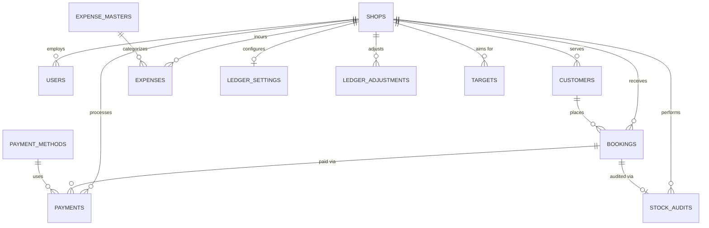

# MySQL Database Design - Version 2 Architecture

This document defines the target relational database architecture for the V2 Migration. It focuses on the architectural design, schema definitions, constraints, and the two major domain shifts requested:
1. Extracting **Customers** into a first-class relational entity.
2. Promoting **Payments** to a first-class entity (replacing "Deliveries").

---

## ER Diagram (Core Architecture)

---

## 1. System & Lookup Tables

### `shops`
**Columns**:
- `id` (Primary Key)
- `name` (String, e.g., "Gaidatailor")
- `is_active` (Boolean)
- `created_at`
- `updated_at`

**Relationships**: Parent to almost all entities in the system.
**Indexes**: `name`
**Constraints**: `name` cannot be null.
**Foreign Keys**: None
**Unique Keys**: `name`
**Business Rules**: Replaces the dynamic collection prefixes. All transaction data is strictly partitioned by `shop_id`.

### `users`
**Columns**:
- `id` (Primary Key)
- `shop_id` (Foreign Key)
- `username` (String)
- `password_hash` (String)
- `role` (Enum: admin, shop)
- `created_at`
- `updated_at`

**Relationships**: Belongs to a Shop.
**Indexes**: `username`
**Constraints**: `username` and `password_hash` cannot be null.
**Foreign Keys**: `shop_id` references `shops(id)`
**Unique Keys**: `username`
**Business Rules**: If `role` is admin, `shop_id` can be null (global access). If `role` is shop, `shop_id` is mandatory.

### `payment_methods`
**Columns**:
- `id` (Primary Key)
- `code` (String, e.g., 'CASH', 'ADIB', 'ATM')
- `name` (String)
- `is_active` (Boolean)

**Relationships**: Used by Payments.
**Indexes**: `code`
**Constraints**: `code` cannot be null.
**Foreign Keys**: None
**Unique Keys**: `code`
**Business Rules**: Replaces the legacy RegEx logic parsing `amountType`. Enforces strict payment categorization.

### `expense_masters`
**Columns**:
- `id` (Primary Key)
- `target_id` (String - Legacy ID mapping)
- `name` (String)
- `type` (Enum: employee, general)
- `department` (String)
- `category` (String)
- `is_active` (Boolean)
- `created_at`
- `updated_at`

**Relationships**: Categorizes Expenses.
**Indexes**: `target_id`, `type`
**Constraints**: `name`, `type`, `department`, `category` cannot be null.
**Foreign Keys**: None (Future optimization: Normalize department/category).
**Unique Keys**: `target_id`
**Business Rules**: Drives the dropdowns on the frontend to prevent typo-based expenses.

---

## 2. Core Business Entities

### `customers` (NEW)
**Columns**:
- `id` (Primary Key)
- `shop_id` (Foreign Key)
- `name` (String)
- `country_code` (String)
- `phone` (String)
- `created_at`
- `updated_at`

**Relationships**: Belongs to Shop, Has Many Bookings.
**Indexes**: `phone`, `shop_id`
**Constraints**: `name` cannot be null.
**Foreign Keys**: `shop_id` references `shops(id)`
**Unique Keys**: `(shop_id, phone)` (A customer phone number should be unique per shop).
**Business Rules**: 
- Extracted from legacy bookings to normalize data. 
- A customer profile can now be tracked over time to see lifetime value across multiple bookings.

### `bookings`
**Columns**:
- `id` (Primary Key)
- `shop_id` (Foreign Key)
- `customer_id` (Foreign Key)
- `bill_no` (String)
- `booking_date` (Date)
- `pieces` (Integer)
- `total_amount` (Decimal)
- `status` (Enum: active, completed, canceled, deducted)
- `update_count` (Integer)
- `created_at`
- `updated_at`

**Relationships**: Belongs to Shop & Customer. Has Many Payments, Has One Stock Audit.
**Indexes**: `booking_date`, `bill_no`, `status`
**Constraints**: `booking_date` and `total_amount` cannot be null.
**Foreign Keys**: 
- `shop_id` references `shops(id)`
- `customer_id` references `customers(id)`
**Unique Keys**: `(shop_id, bill_no)`
**Business Rules**: 
- The central transaction entity. 
- Represents the gross revenue expectation. If `status` is canceled/deducted, it is excluded from net income calculations.

### `payments` (Replaces 'Deliveries')
**Columns**:
- `id` (Primary Key)
- `shop_id` (Foreign Key)
- `booking_id` (Foreign Key, Nullable)
- `payment_method_id` (Foreign Key)
- `amount` (Decimal)
- `payment_date` (Date)
- `update_count` (Integer)
- `created_at`
- `updated_at`

**Relationships**: Belongs to Shop, Booking, and Payment Method.
**Indexes**: `payment_date`
**Constraints**: `amount` and `payment_date` cannot be null.
**Foreign Keys**: 
- `shop_id` references `shops(id)`
- `booking_id` references `bookings(id)`
- `payment_method_id` references `payment_methods(id)`
**Unique Keys**: None
**Business Rules**: 
- Elevates financial transactions to a first-class entity.
- If `booking_id` is null, it represents a generic/misc shop payment (replacing the legacy `billNo: "other-amounts"` hack).
- Drives the daily ledger cash drawer math.

### `expenses`
**Columns**:
- `id` (Primary Key)
- `shop_id` (Foreign Key)
- `expense_master_id` (Foreign Key)
- `amount` (Decimal)
- `expense_date` (Date)
- `description` (String)
- `created_at`
- `updated_at`

**Relationships**: Belongs to Shop, Belongs to Expense Master.
**Indexes**: `expense_date`
**Constraints**: `amount` and `expense_date` cannot be null.
**Foreign Keys**: 
- `shop_id` references `shops(id)`
- `expense_master_id` references `expense_masters(id)`
**Unique Keys**: None
**Business Rules**: 
- If the linked `expense_masters.department` is "profit", the amount is excluded from operational expenses and treated as a profit payout.

---

## 3. Operations & Auditing

### `stock_audits`
**Columns**:
- `id` (Primary Key)
- `shop_id` (Foreign Key)
- `booking_id` (Foreign Key)
- `status` (Enum: checked, archived)
- `batch_label` (String)
- `remark` (String)
- `qty` (Integer)
- `missing_pcs` (Integer)
- `balance_amount` (Decimal)
- `checked_at` (Datetime)

**Relationships**: Belongs to Shop and Booking.
**Indexes**: `status`, `checked_at`
**Constraints**: `status` cannot be null.
**Foreign Keys**: 
- `shop_id` references `shops(id)`
- `booking_id` references `bookings(id)`
**Unique Keys**: `(booking_id, batch_label)` (An order can only be checked once per batch).
**Business Rules**: 
- Tracks the physical verification of stock. 
- Linking directly to `booking_id` removes the need for in-memory JavaScript string matching against legacy `billNo`s.

### `ledger_settings`
**Columns**:
- `id` (Primary Key)
- `shop_id` (Foreign Key)
- `initial_balance` (Decimal)
- `start_date` (Date)
- `created_at`
- `updated_at`

**Relationships**: Belongs to Shop (1:1).
**Indexes**: None
**Constraints**: `start_date` cannot be null.
**Foreign Keys**: `shop_id` references `shops(id)`
**Unique Keys**: `shop_id`
**Business Rules**: Dictates the mathematical origin point for a shop's running cash ledger.

### `ledger_adjustments`
**Columns**:
- `id` (Primary Key)
- `shop_id` (Foreign Key)
- `adjustment_date` (Date)
- `amount` (Decimal)
- `note` (String)
- `created_at`
- `updated_at`

**Relationships**: Belongs to Shop.
**Indexes**: `adjustment_date`
**Constraints**: `adjustment_date` and `amount` cannot be null.
**Foreign Keys**: `shop_id` references `shops(id)`
**Unique Keys**: `(shop_id, adjustment_date)`
**Business Rules**: Captures end-of-day drawer discrepancies. Only one adjustment allowed per shop per day. Positive amount means extra cash; negative means short cash.

### `targets`
**Columns**:
- `id` (Primary Key)
- `shop_id` (Foreign Key)
- `target_year` (Integer)
- `target_month` (Integer)
- `amount` (Decimal)
- `created_at`
- `updated_at`

**Relationships**: Belongs to Shop.
**Indexes**: `(target_year, target_month)`
**Constraints**: `target_year`, `target_month`, `amount` cannot be null.
**Foreign Keys**: `shop_id` references `shops(id)`
**Unique Keys**: `(shop_id, target_year, target_month)`
**Business Rules**: Used by analytics to compare actual gross income against monthly goals. Month is strictly 1-12 (fixing legacy 0-11 logic).
